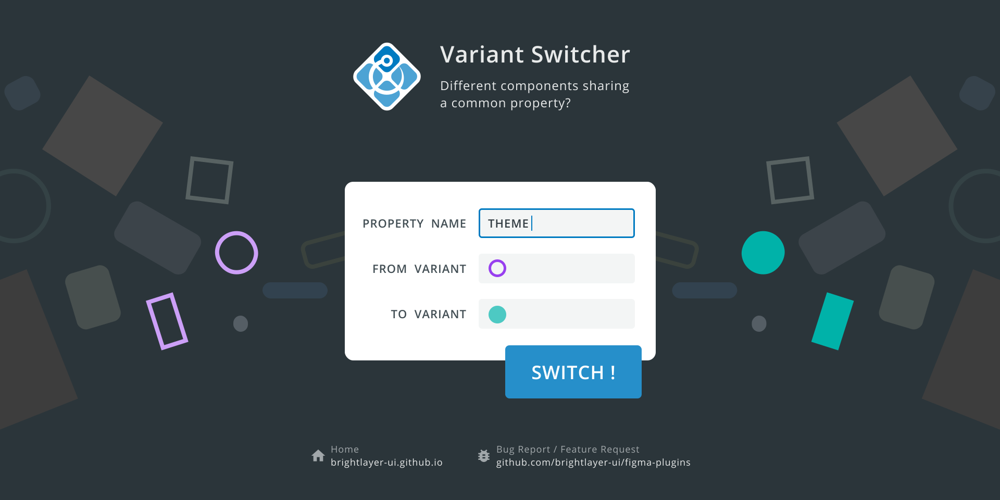
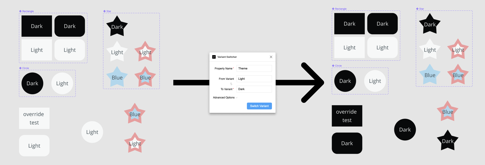

# Variant Switcher



The Variant Switcher plugin takes all of your selected component instances and recursively changes them to a different variant based on the specified property.

[Install it for your Figma workspace](https://www.figma.com/community/plugin/971482182464094790/Variant-Switcher)

## Usage

The Variant Switcher plugin has four input fields:

| Input Field          | Description                                                                                                                                                                        | Required? |
| -------------------- | ---------------------------------------------------------------------------------------------------------------------------------------------------------------------------------- | --------- |
| Property Name        | the property you want to change                                                                                                                                                    | yes       |
| From Variant         | the current value you want to target (leave blank to select all instances with the selected property regardless of the current value)                                              | no        |
| To Variant           | the new value you want to set the property to                                                                                                                                      | yes       |
| Deep Switch          | When unchecked, the plugin will not switch children after switching parent instance. ([Diagram explanation](./_assets_/deep-switch-diagram.png))                                   | yes       |
| Exact Match          | Whether to check for the exact property name and variant name                                                                                                                      | yes       |
| Switch Full Document | When checked, the plugin will traverse through the entire document. When unchecked, the plugin will only switch the current selection, or the current page if nothing is selected. | yes       |
| Main Component Name  | Change only instances with the specified main component name                                                                                                                       | no        |

## Example



Consider the example above. In this case, all of the components have a `Theme` property (all of them have a "Light" and "Dark" variant and the Star has an additional "Blue" variant). When using the plugin, we set the `Property Name` field to "Theme", `From Variant` to "Light", and `To Variant` to "Dark". The plugin traverses through all selected nodes finding any instances whose `Theme` properties are set to "Light", and changes them to "Dark".

> Notice that the Star component was unchanged because the current value of its `Theme` property was "Blue", not "Light". If we had left the "From Variant" field blank, then the Star would have also been changed because the plugin would select all nodes with the `Theme` property regardless of the current value.

## Running Plugin Locally (For Developers)

To run the plugin locally, first clone the repository:

```sh
git clone https://github.com/brightlayer-ui/figma-plugins
```

Then, link the plugin to Figma:

-   Open the Figma desktop app and in the toolbar go to `Plugins > Development > New Plugin`.
-   In the dialog box, under "Link existing plugin" either click the box to select a file or drag and drop it into the dotted box.
    -   Use the `manifest.json` file from the repo you just cloned.

Finally, build the plugin:

```sh
cd path/to/figma-plugins/variant-switcher
yarn && yarn build
```

The plugin should now be running happily.

> To build in production mode, run `yarn && yarn build:production`. See results in `/dist` folder.
