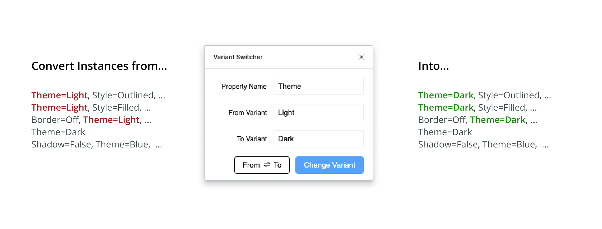
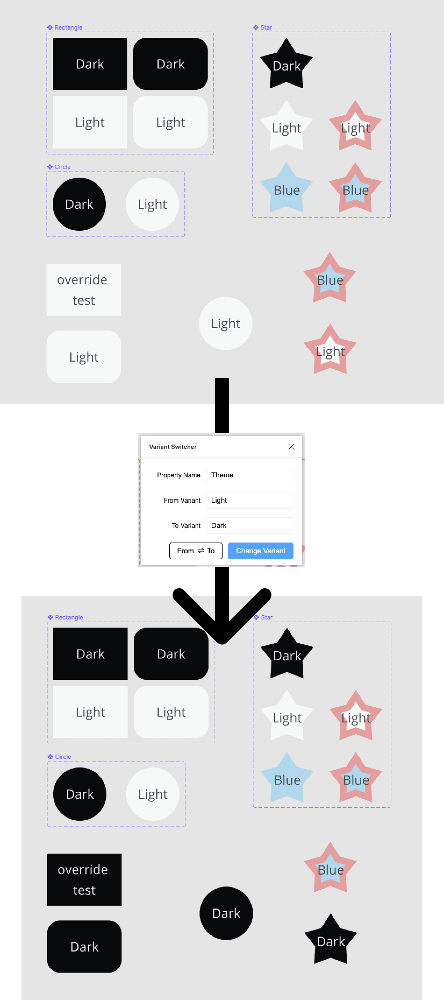

# Variant Switcher

Given a selection of instances, recursively replace everything to a certain variant under a given property.

For example, if "Property Name" is set to "Theme", "From Variant" is set to "Light", and "To Variant" is set to "Dark", then this plugin will traverse through all selected nodes, see if there are instances with "Theme=Light", and change them recursively to "Theme=Dark".

## An Example

## Develop Plugin Locally

To run the plugin locally, first clone this repo. After that, go to Figma, then Plugins > Developement > New Plugin. In the dialog box, do the "Link existing plugin" - "Click to choose a manifest.json". Locate `manifest.json` from the repo you just cloned.

Then in your local repo, cd to this `variant-switcher` folder, and `yarn && npx webpack`. Then the plugin should be happily running.
